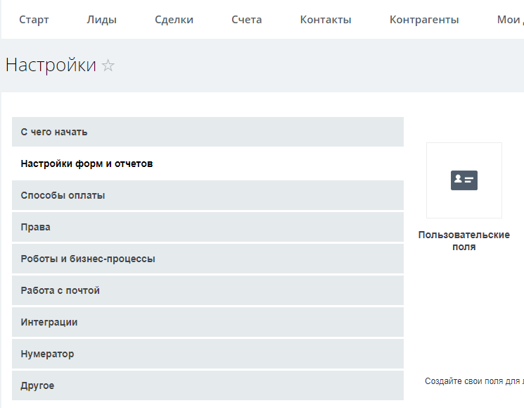
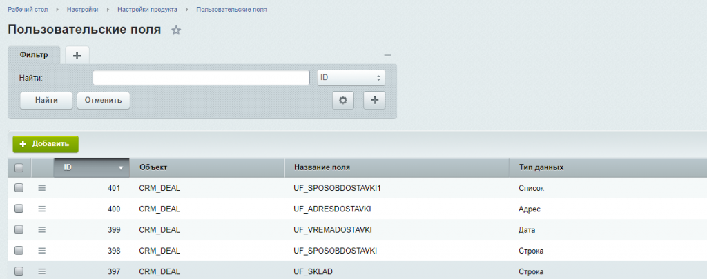
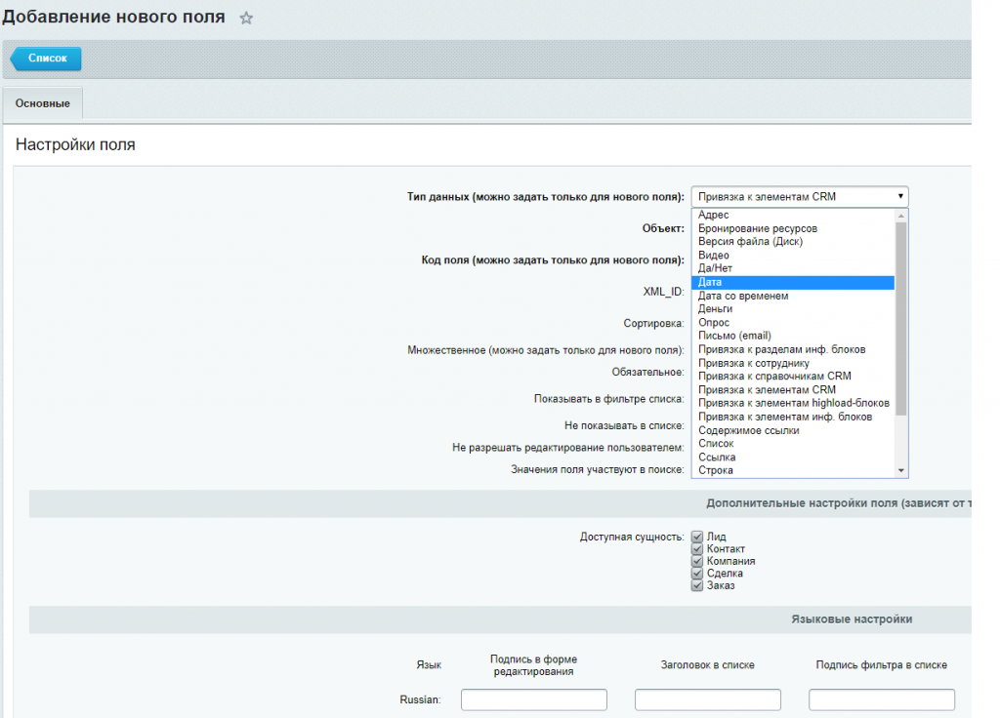

## Работа с пользовательскими полями в Битрикс24 API

В доработке СРМ Битрикс24 часто приходится создавать дополнительные поля для сущностей СРМ - лидов, компаний, контактов, сделок и др.

В принципе в СРМ Битрикс24 создан удобный интерфейс, чтобы добавлять свои поля разного типа без помощи программиста, но для такой сущности как Дела - встречи, звонки, письма - эту возможность не сделали.

Поэтому я хочу рассказать, как я работаю с пользовательскими полями в Битрикс24.
Рассмотрим работу с пользовательскими полями на примере сделки СРМ Битрикс24. С остальными сущностями аналогично.

Во-первых, лучше добавлять новые поля не через форму добавления сделки или в настройках СРМ Битрикс24, 



а через административный раздел на странице пользовательских полей. 



Потому что так можно задать символьный код для такого поля в удобном для программирования виде.

Пользовательские поля имеют разные типы - строка, список, привязка к элементам и разделам инфоблоков, дата, число, привязка к сущностям СРМ, привязка к справочникам СРМ. Сейчас еще появились новые типы - адрес, шаблон, ссылка - но в СРМ они пока не работают.



Разберем основной код для установки значения пользовательского поля и поиска по пользовательскому полю.

Для работы с пользовательскими полями используется глобальная переменная $USER_FIELD_MANAGER.

Установка значения текстового поля:
```php
$GLOBALS["USER_FIELD_MANAGER"]->Update("CRM_DEAL", $idDeal, Array("UF_NEWPOLE"=>$value));
```
где "CRM_DEAL" - для какой сущности мы изменяем значение,
    $idDeal - id конкретной сделки,
    "UF_NEWPOLE" - символьный код пользовательского поля,
    $value - одно значение или массив, если поле множественное.

Получение значений пользовательских полей сделки:
```php
$arUserFields1 = $GLOBALS["USER_FIELD_MANAGER"]->GetUserFields("CRM_DEAL", $idDeal);
```
Так мы получим массив всех пользовательских полей со значениями для конкретной сделки с id =$idDeal.

Поиск сделок с определенным значением пользовательского поля можно осуществлять через CCrmDeal::GetListEx:  
```php
	 $dbDeal=CCrmDeal::GetListEx(
	 array("ID"=>"ASC"),
	 array(">=BEGINDATE"=>$begin,"<=BEGINDATE"=>$end,"!UF_NEWPOLE"=>false),
	 false,
	 false,
	 array("ID","BEGINDATE","STAGE_ID","OPPORTUNITY","ASSIGNED_BY_ID","CLOSEDATE","UF_NEWPOLE"),
	 array()); 


	 while($arDeal=$dbDeal->fetch()){ 
	 var_dump($arDeal); 
	 } 
```

### Работа с пользовательскими полями типа список отличается от работы со строковыми полями.

Значение, которое устанавливается для сделки, должно быть равно id значения из списка, но если нам приходит, например из 1с, текстовое значение, то сначала мы должны найти это id:
```php
	  $obEnum = new \CUserFieldEnum; 
	  $rsEnum = $obEnum->GetList(array(), array("USER_FIELD_ID" => $idField)); 
	  while($arEnum = $rsEnum->Fetch()){
	    if($arEnum["VALUE"]==$value){ 
	      $idvalue=$arEnum["ID"];
	    } 
	  } 
```

где $idField - id а не символьный код нашего пользовательского поля типа список.

$value - текстовое значение, которое мы ищем в списке,

$idvalue - id значения из списка, которое мы используем для установки значения сделке в следующем коде:
```php
$GLOBALS["USER_FIELD_MANAGER"]->Update("CRM_DEAL", $idDeal, Array("UF_NEWPOLELIST"=>$idvalue));
```

### Как установить значение полю "Да/нет"?

```php
$GLOBALS["USER_FIELD_MANAGER"]->Update("CRM_DEAL", $idDeal, Array("UF_DANET"=>$value));
```
где $value=0 если нет, и $value=1 если да.

### Как получить название пользовательского поля на русском языке, если вы знаете его код?

Обязательно нужно указать язык 'LANG' => 'ru', тогда придет название поля на русском языке.
```php
    $rsData = CUserTypeEntity::GetList(array("ID"=>"ASC"), array("FIELD_NAME"=>"UF_TEST",'LANG' => 'ru'));
    
    while($arRes = $rsData->Fetch())
    
    {
    
    $title= $arRes["EDIT_FORM_LABEL"];
    
    }
```
### Как в компонентах списков сделок, контактов ,компаний, лидов - добавляются фильтры для пользовательских полей?

```php
$USER_FIELD_MANAGER->AdminListAddFilter(CCrmDeal::$sUFEntityID, $arFilter);
```

### Изменение вида поля в карточке СРМ. Кастомизация дизайна поля в карточке СРМ. 
Для этого используется специальное событие "onGetPublicView" модуля main

Добавьте обработчик события
```php
EventManager::getInstance()->addEventHandler(
    "main",
    "onGetPublicView",
    ["EventHandlers\\UserFieldHandler", "onGetPublicViewHandler"]
);
 public static function onGetPublicViewHandler(Event $event): EventResult
    {
        $arUserField = $event->getParameters()[0];

        if ($arUserField['FIELD_NAME'] === "UF_CODE") {
/*измените поле как надо */
  $newView = $arUserField['VALUE']. "плюс ваш текст или верстка или дополнительные данные";
 return new EventResult(EventResult::SUCCESS, $newView);
      }
else{
                return new EventResult(EventResult::ERROR);
        }
    }
```